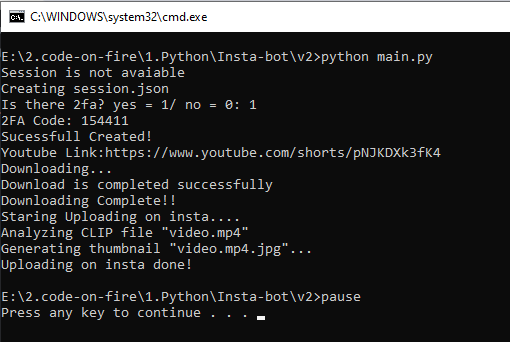

# Insta Bot v2

<!--Remove the below lines and add yours -->

This Python script serves as a Insta Uploading Bot & its takes youtube short link upload them to insta account with a media.

### Features

Config: insta account info Fully Secured
Tweet: Insta reel with text and media
thumbnail Generator: It converts media into a picture
No Ip chnager requided.

### Prerequisites
* instagrapi
* pytube

### How to run the script

<!--Remove the below lines and add yours -->

```
$ python main.py
```

### Screenshot/GIF showing the sample use of the script

<!--Remove the below lines and add yours -->


### Important Files

config.py: Configuration file containing account info.

## Working

This Python script integrates with Instagram and YouTube to automate the process of downloading videos from YouTube and uploading them to Instagram. It utilizes the instagrapi library for interacting with Instagram and pytube for handling YouTube downloads.

## _Author Name_

<!--Remove the below lines and add yours -->
This script was created by [milliyin](https://github.com/milliyin)
Feel free to contribute to this project by submitting issues or pull requests.
