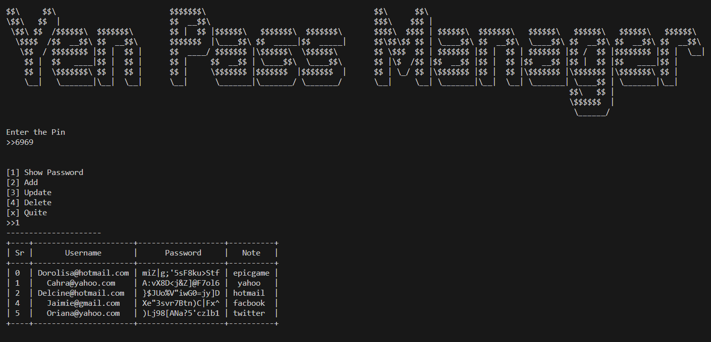

# Password Manager

<!--Remove the below lines and add yours -->

Python script for Managing Password

### Prerequisites
* Fernet
* json
* PrettyTable
* random
* string

### How to run the script

<!--Remove the below lines and add yours -->

```
$ python main1.0.py
```

### Screenshot/GIF showing the sample use of the script

<!--Remove the below lines and add yours -->



## Working

Loads config file, and use pin to access the password in which its decrypted password which is set in database.json and can do all basic functions. while exiteing it encrypt the passwords back to the database

## _Author Name_

<!--Remove the below lines and add yours -->

[milliyin](https://github.com/milliyin)
