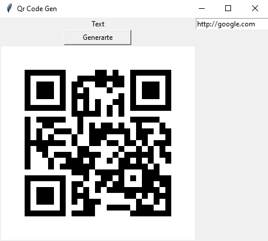

# Qr Generator

<!--Remove the below lines and add yours -->

This Python script serves as a Qr Generator that allows users to enter the text to make qr.

### Features

Gui Supported

### Prerequisites
* qrcode
* tkinter
* PIL

### How to run the script

<!--Remove the below lines and add yours -->

```
$ python main.py
```
### Screenshot/GIF showing the sample use of the script

<!--Remove the below lines and add yours -->



## _Author Name_

<!--Remove the below lines and add yours -->
This script was created by [milliyin](https://github.com/milliyin)
Feel free to contribute to this project by submitting issues or pull requests.
