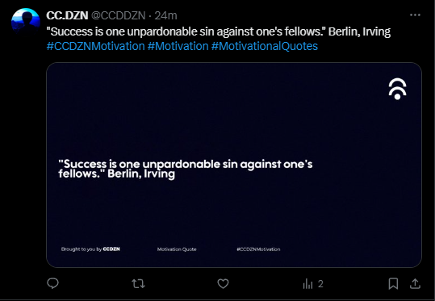

# Twitter Bot

<!--Remove the below lines and add yours -->

This Python script serves as a Quote generator & Upload them to Twitter account with a media.

### Features

Config: Api Keys Fully Secured
Tweet: Tweet with text and media
Image Generator: It converts text into a media.
Quotes: Randomly From an Api

### Prerequisites
* tweepy
* json
* textwrap
* PIL
* requests

### How to run the script

<!--Remove the below lines and add yours -->

```
$ python main.py
```

### Screenshot/GIF showing the sample use of the script

<!--Remove the below lines and add yours -->


### Important Files

config.py: Configuration file containing API keys.

## Working

The X-api is utilized for retrieving a quote along with the name of the author. The Python Imaging Library (PIL) is employed to overlay this text onto a template image. Subsequently, the resulting image is saved into a designated folder. The Tweepy library is then employed to compose a tweet, incorporating both the quote and author information as text, along with attaching the image to the tweet.

## _Author Name_

<!--Remove the below lines and add yours -->
This script was created by [milliyin](https://github.com/milliyin)
Feel free to contribute to this project by submitting issues or pull requests.
