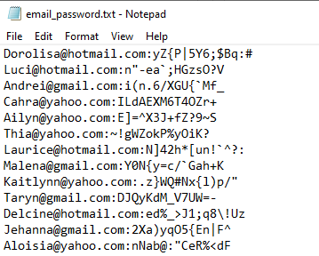

# Combos Genrator
This script generate combos in email:password formate

### Prerequisites
* random
* string
* json
* time

### How to run the script

<!--Remove the below lines and add yours -->

```
$ python main1.0.py
```

### Screenshot/GIF showing the sample use of the script
<!--Remove the below lines and add yours -->


## Working
The script first loads the names.json file and generate mix emails address with a random password using all of the ASCII characters

## Author Name
[milliyin](https://github.com/milliyin)
