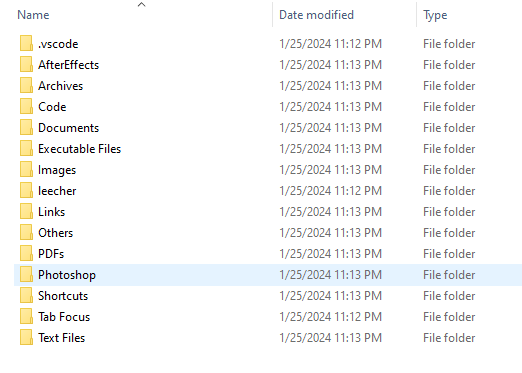

# File Organizer

<!--Remove the below lines and add yours -->

Python script for organizing your mixed files of any folder/desktop


### How to run the script

<!--Remove the below lines and add yours -->

```
$ python main.py
```

### Screenshot/GIF showing the sample use of the script

<!--Remove the below lines and add yours -->



## _Author Name_

<!--Remove the below lines and add yours -->

[milliyin](https://github.com/milliyin)
